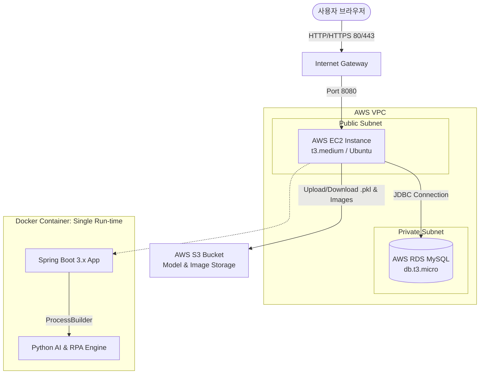
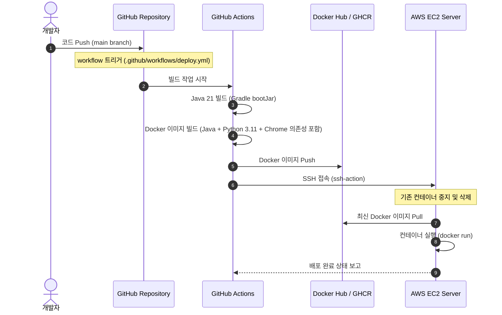
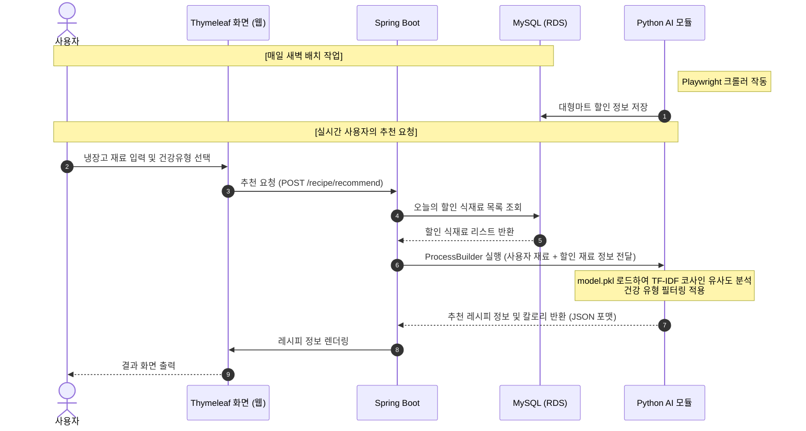

# 냉장고 파먹기 AI 레시피 추천 시스템: 아키텍처 및 파이프라인 설계

본 문서는 MLOps와 DevOps가 적용된 "냉장고 파먹기 AI 레시피 추천 시스템" 프로젝트의 시작 단계로서, AWS 리소스 설계와 전체 파이프라인 아키텍처를 정의합니다.

---

## 1. 시스템 아키텍처 (AWS 리소스 설계)

전체 시스템은 보안성과 비용 효율성을 동시에 만족하도록 설계되었습니다. 프리티어(Free Tier) 범위 내에서 구동 가능하도록 최적의 인스턴스 사양을 정의합니다.

### 시스템 구조도 (AWS Architecture)



### AWS 리소스 상세 명세

| 서비스명 | 리소스 사양 | 용도 | 설명 / 비고 |
| :--- | :--- | :--- | :--- |
| **VPC** | Custom VPC (10.0.0.0/16) | 네트워크 격리 | 기본 VPC 대신 개발용 서브넷 격리 적용 |
| **EC2** | `t3.micro` (vCPU 2, RAM 1GB) | 웹 서버 및 배치 수행 | **프리티어 적용**. 단, RAM 1GB 한계로 인한 OOM(Out of Memory) 방지를 위해 EC2 인스턴스에 **2GB Swap 메모리 설정** 필수 |
| **RDS** | `db.t3.micro` (MySQL 8.0) | 데이터베이스 | 사용자 정보, 마트 할인 정보, 레시피 메타데이터 저장 |
| **S3** | Standard Bucket | 파일 스토리지 | 1) 크롤링한 식재료 이미지 저장<br>2) 학습된 AI 모델 파일(`.pkl`) 버전별 저장 |
| **IAM** | EC2 Instance Role | 권한 제어 | EC2가 Access Key 없이 S3에 안전하게 접근할 수 있도록 IAM 역할 부여 |

---

## 2. DevOps 파이프라인 (CI/CD)

GitHub Actions와 Docker를 활용하여 빌드 및 배포 과정을 완전히 자동화합니다.

### CI/CD 흐름도



### Docker 이미지 설계 (단일 컨테이너 구성)
Spring Boot 애플리케이션 내에서 `ProcessBuilder`로 Python 및 Playwright를 실행해야 하므로, 단일 Dockerfile 안에 Java, Python, Playwright 구동용 Chromium 브라우저 및 의존성 패키지를 모두 설치해야 합니다.

```dockerfile
# 1. Build stage for Java
FROM gradle:8.5-jdk21 AS java-build
COPY --chown=gradle:gradle . /home/gradle/src
WORKDIR /home/gradle/src
RUN gradle bootJar --no-daemon

# 2. Run stage (Ubuntu 베이스로 Java, Python, Chrome 환경 통합)
FROM ubuntu:22.04

# 환경변수 설정 (타임존 설정 등의 프롬프트 방지)
ENV DEBIAN_FRONTEND=noninteractive
ENV JAVA_HOME=/usr/lib/jvm/java-21-openjdk-amd64
ENV PATH="$PATH:$JAVA_HOME/bin"

# Java 21, Python 3.11 및 필수 라이브러리 설치
RUN apt-get update && apt-get install -y \
    openjdk-21-jre-headless \
    python3.11 \
    python3-pip \
    curl \
    wget \
    gnupg \
    && rm -rf /var/lib/apt/lists/*

# Python 패키지 설치
COPY requirements.txt /app/requirements.txt
RUN pip3 install --no-cache-dir -r /app/requirements.txt

# Playwright 및 Chromium 브라우저 의존성 설치
RUN pip3 install playwright
RUN playwright install --with-deps chromium

# Spring Boot 빌드 결과물 복사
WORKDIR /app
COPY --from=java-build /home/gradle/src/build/libs/*.jar app.jar
COPY ./python-ai /app/python-ai
COPY ./crawler /app/crawler

EXPOSE 8080
ENTRYPOINT ["java", "-jar", "app.jar"]
```

---

## 3. MLOps 파이프라인 (모델 생명주기 관리)

데이터 수집부터 모델 재학습, S3 저장, 서버 적용까지의 생명주기를 자동화합니다.

### MLOps 파이프라인 구성도

```mermaid
graph LR
    subgraph DataCollect [1. 데이터 수집]
        Playwright[Playwright Crawler] -->|할인정보 수집| RDS[(RDS MySQL)]
    end

    subgraph TrainPipeline [2. 학습 및 버전 관리]
        RDS -->|신규 데이터 피드| TrainScript[train.py 학습 진행]
        TrainScript -->|TF-IDF + Cosine Similarity| ModelFile[model.pkl 생성]
        ModelFile -->|AWS CLI 업로드| S3[(S3 Bucket)]
    end

    subgraph Serving [3. 서빙 및 추론]
        S3 -->|배포 시 또는 주기적 다운로드| LocalCache[Local Storage]
        Spring[Spring Boot] -->|ProcessBuilder 실행| Inference[predict.py 실행]
        LocalCache --> Inference
        Inference -->|추천 결과 반환| Spring
    end
```



### MLOps 자동화 흐름

1.  **데이터 업데이트**: 매일 새벽 1시, Python Playwright 크롤러가 대형마트 할인 정보를 크롤링하여 RDS MySQL에 적재합니다.
2.  **재학습 트리거**: 
    *   **GitHub Actions를 활용한 크론탭 방식**: 매일 새벽 3시, GitHub Actions가 트리거되어 RDS에서 최신 레시피 및 재료 데이터를 읽어 `train.py`를 실행합니다.
    *   새롭게 갱신된 추천 모델 `model.pkl`과 `vectorizer.pkl`을 생성합니다.
3.  **모델 버전 관리**: 생성된 모델 파일은 파일명 뒤에 타임스탬프를 붙여 S3 버킷(`s3://recipe-models/archive/model_YYYYMMDD.pkl`)에 아카이빙하고, 동시에 실시간 서빙용 경로(`s3://recipe-models/latest/model.pkl`)를 덮어씁니다.
4.  **모델 무중단 배포**:
    *   Spring Boot 서버는 구동 시 S3에서 `latest/model.pkl`을 다운로드하여 로컬 파일 시스템 캐시에 로드합니다.
    *   매주 혹은 일 단위로 Spring Boot 내부 스케줄러(`@Scheduled`)가 S3의 최신 모델을 조회하여 새로운 파일이 있으면 자동으로 갱신(Hot-reload)합니다.

---

## 4. 핵심 데이터 흐름 (RPA ↔ DB ↔ AI ↔ Web)

사용자가 냉장고 재료를 입력하고 추천을 요청할 때의 데이터 교환 흐름입니다.



---

## 5. 단계별 검증 계획 (Verification Plan)

### (1) 개발 환경 검증 (Local Testing)
*   **RPA 검증**: `python crawler/crawler.py` 실행 시 실제 브라우저가 구동되며(이마트/홈플러스 등) 데이터가 MySQL 로컬 스키마에 정상 인입되는지 확인합니다.
*   **AI 모델 검증**: `train.py` 실행을 통한 `.pkl` 모델 생성과 `predict.py`를 활용한 JSON 반환 결과의 적절성을 단위 테스트합니다.
*   **통합 검증**: Spring Boot에서 `ProcessBuilder`로 Python 스크립트를 호출했을 때, 한글 깨짐 없이 정상적으로 JSON 데이터가 받아와지는지 확인합니다.

### (2) 스테이징/운영 배포 검증 (AWS & CI/CD Testing)
*   **GitHub Actions CI 검증**: 코드 푸시 시 Docker 이미지가 빌드 과정에서 Chromium 및 Python 패키지 의존성을 에러 없이 포함하는지 빌드 로그를 확인합니다.
*   **Docker 컨테이너 메모리 모니터터링**: EC2 내 구동 중인 단일 Docker 컨테이너의 메모리 사용량을 `docker stats` 명령어로 추적하여 `t3.medium` 메모리(4GB) 내에서 안정적으로 동작하는지 확인합니다.
*   **S3 연동 검증**: AWS IAM 역할 설정을 통해 EC2 컨테이너 내부의 Python 스크립트가 Access Key 없이 S3 버킷에 `.pkl` 모델을 읽고 쓸 수 있는지 권한을 테스트합니다.
